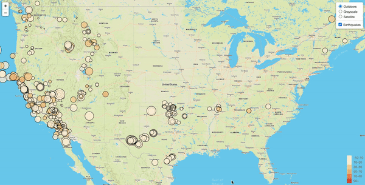

# usgs-map

A webpage for visualizing the last 30 days of earthquake data obtained from [US Geological Surveys website](https://earthquake.usgs.gov/earthquakes/feed/v1.0/geojson.php).  
View the interactive map [here](https://mvhaynes.github.io/usgs-map/). 

## Summary 
This visualization turns raw geoJSON data into an interactive visualization to display the location, magnitude, and depth of each event. 

Raw geoJSON:  
`{"type":"FeatureCollection",
"metadata":
    {"generated":1619824149000,"url":"https://earthquake.usgs.gov/earthquakes/feed/v1.0/summary/all_month.geojson","title":"USGS All Earthquakes, Past Month","status":200,"api":"1.10.3","count":2617},
    "features":[{"type":"Feature","properties":{"mag":1.3,"place":"30 km SW of Hawthorne, Nevada","time":1619821705199,...}`

## Visualization 
  
Each marker's size represents the earthquake's magnitude and the color represents the depth.   Users can click on each point to learn more about the event. 
 
 
The map offers three layers to choose from: 'Satellite', 'Grayscale', and 'Outside' (tile layers obtained from Mapbox). Users can use the upper right controls to toggle between layers. Users can also toggle on/off earthquake markers or tectonic plate lines. 

## Tools 
Leaflet, Javascript

