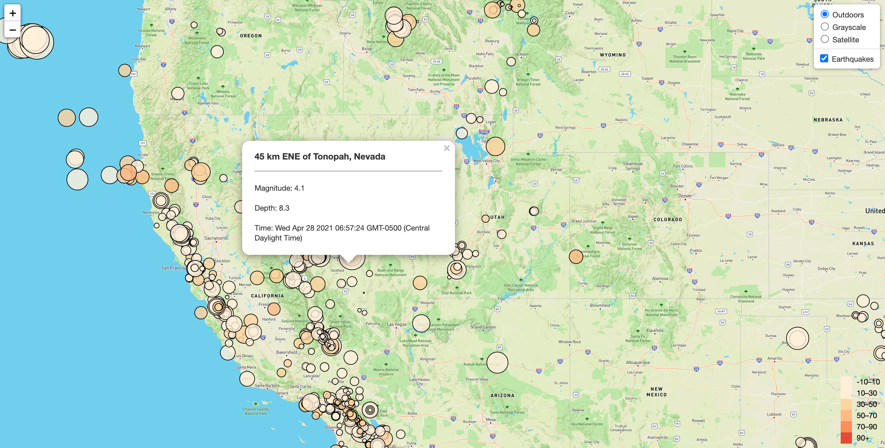
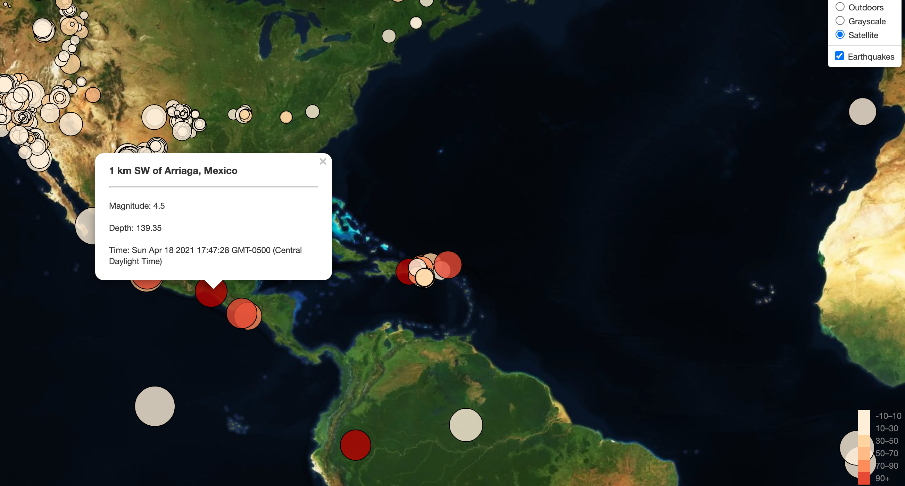

# usgs-map

A webpage for visualizing earthquake geoJSON data obtained from US Geological Surveys website. 

## Summary 
This visualization turns illegible geoJSON data into an interactive visualization.

GeoJSON: 
{"type":"FeatureCollection","metadata":{"generated":1619824149000,"url":"https://earthquake.usgs.gov/earthquakes/feed/v1.0/summary/all_month.geojson","title":"USGS All Earthquakes, Past Month","status":200,"api":"1.10.3","count":2617},"features":[{"type":"Feature","properties":{"mag":1.3,"place":"30 km SW of Hawthorne, Nevada","time":1619821705199,"updated":1619821956047,"tz":null,"url":"https://earthquake.usgs.gov/earthquakes/eventpage/nn00806231","detail":"https://earthquake.usgs.gov/earthquakes/feed/v1.0/detail/nn00806231.geojson","felt":null,"cdi":null,"mmi":null,"alert":null,"status":"automatic","tsunami":0,"sig":26,"net":"nn","code":"00806231","ids":",nn00806231,","sources":",nn,","types":",origin,phase-data,","nst":10,"dmin":0.34,"rms":0.29,"gap":174.44,"magType":"ml","type":"earthquake","title":"M 1.3 - 30 km SW of Hawthorne, Nevada"},"geometry":{"type":"Point","coordinates":[-118.9105,38.3699,0.7]},"id":"nn00806231"},

## Visualization 

The webpage uses Leaflet and Javascript to plot the geoJSON data. Each marker size represents an earthquake's magnitude and the color represents the depth. Users can click on each point to learn more about the event. 

The visualization offers three layers to choose from: 'Satellite', 'Grayscale', and 'Outside' (tile layers obtained from Mapbox). 